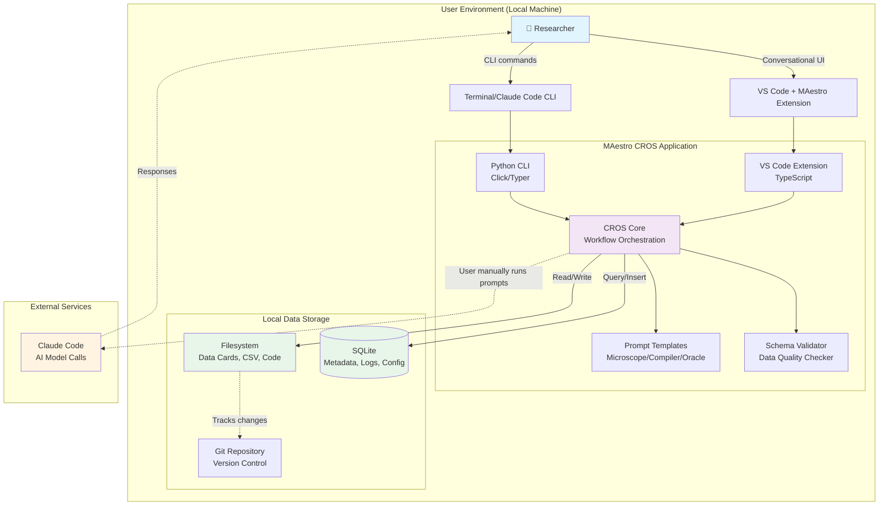
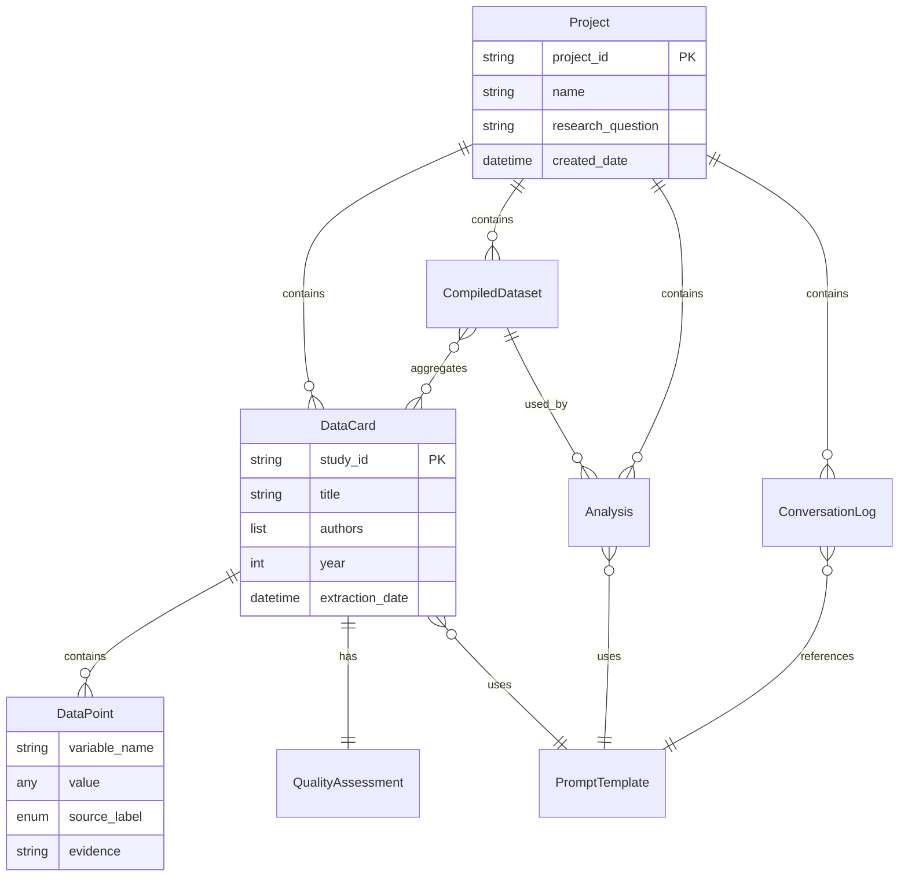
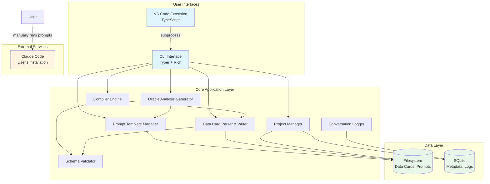
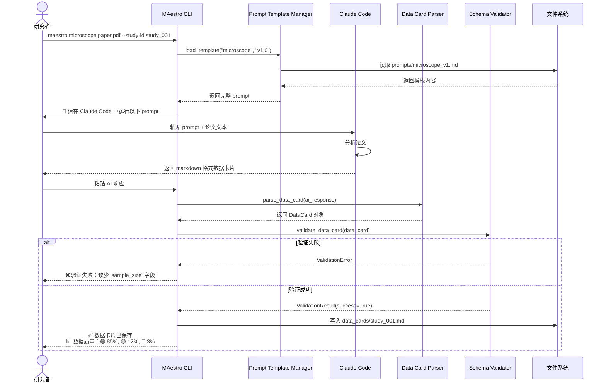
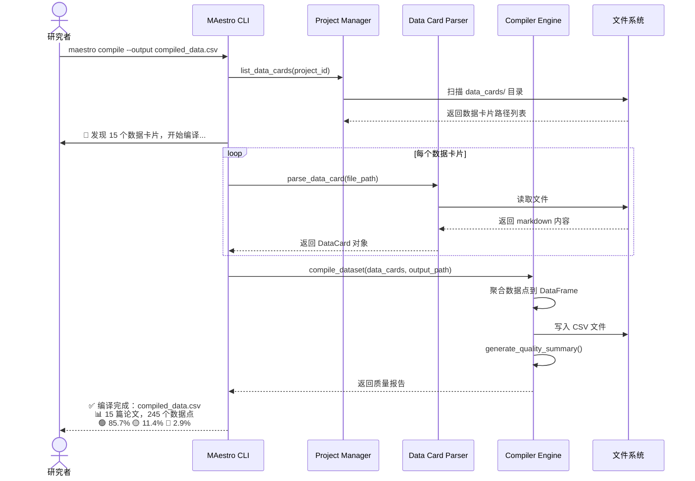
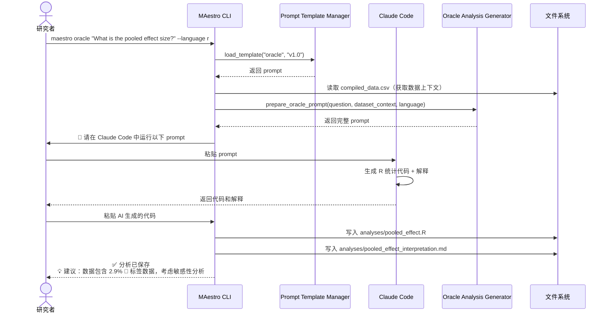
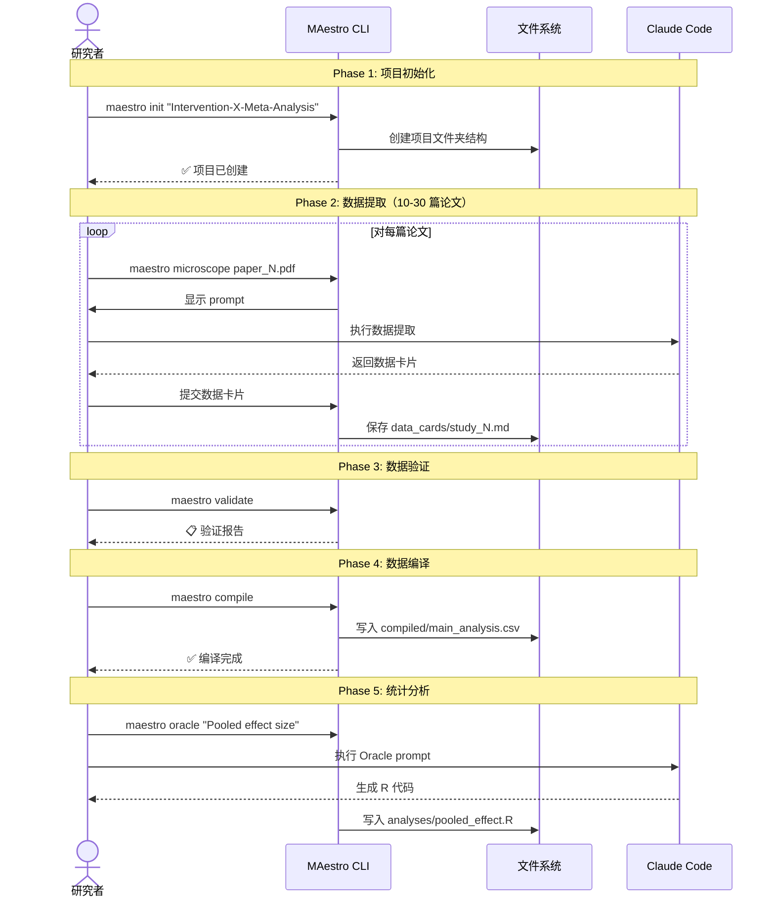

# MAestro Architecture Document

**Version:** 0.1
**Last Updated:** 2025-10-19
**Author:** Winston (Architect Agent)

---

## Table of Contents

1. [Introduction](#introduction)
2. [High Level Architecture](#high-level-architecture)
3. [Tech Stack](#tech-stack)
4. [Data Models](#data-models)
5. [Components](#components)
6. [External APIs](#external-apis)
7. [Core Workflows](#core-workflows)
8. [Database Schema](#database-schema)
9. [Source Tree](#source-tree)
10. [Infrastructure and Deployment](#infrastructure-and-deployment)
11. [Error Handling Strategy](#error-handling-strategy)
12. [Coding Standards](#coding-standards)
13. [Test Strategy and Standards](#test-strategy-and-standards)
14. [Security](#security)

---

## Introduction

This document outlines the overall project architecture for **MAestro**, including backend systems, shared services, and non-UI specific concerns. Its primary goal is to serve as the guiding architectural blueprint for AI-driven development, ensuring consistency and adherence to chosen patterns and technologies.

**Relationship to Frontend Architecture:**
MAestro's CROS phase includes a VS Code Extension with a conversational UI. A separate Frontend Architecture Document may be created to detail the frontend-specific design, which MUST be used in conjunction with this document. Core technology stack choices documented herein (see "Tech Stack") are definitive for the entire project, including any frontend components.

### Starter Template or Existing Project

Based on the PRD and project context, MAestro is a **greenfield project** with a unique architectural approach:

**MVP Phase:** No traditional starter template applies. The system is a collection of markdown prompt templates stored in a Git repository. There's no application to "start" - users directly interact with Claude Code using the prompts.

**CROS Phase:** The project will build:
1. **Python CLI** - A command-line interface tool distributed via PyPI
2. **VS Code Extension** - A conversational interface integrated into VS Code

**Decision:** N/A for MVP (pure markdown templates). For CROS phase, individual project scaffolding tools will be used as needed.

### Change Log

| Date | Version | Description | Author |
|------|---------|-------------|--------|
| 2025-10-19 | v0.1 | Initial architecture document draft | Winston (Architect) |

---

## High Level Architecture

### Technical Summary

MAestro employs a **dual-phase evolutionary architecture** that transitions from pure prompt-based workflows (MVP) to a local-first desktop application (CROS). The MVP phase consists of version-controlled markdown prompt templates executed directly through Claude Code with zero application infrastructure. The CROS phase introduces a **local monolithic application** comprising a Python CLI (distributed via PyPI) and a VS Code Extension (distributed via VS Code Marketplace), both interacting with the Anthropic Claude API for AI-powered Meta-analysis workflows. All user data remains local (filesystem + SQLite), implementing **data card microservice architecture** where individual markdown files serve as atomic data units. This architecture achieves the PRD's 50% time reduction goal through conversation-driven automation while maintaining academic rigor via the three-color source labeling transparency system (🟢🟡🔴).

### High Level Overview

**1. Architectural Style:**

**MVP Phase:** **Template-Driven Stateless Workflow**
- No application server, no persistent state beyond filesystem
- Users manually execute prompt templates via Claude Code CLI/Desktop
- Pure markdown I/O with Git as version control system

**CROS Phase:** **Local Monolithic Desktop Application**
- Python CLI: Command-line orchestrator for batch operations and automation
- VS Code Extension: Conversational UI with rich text editing and visualization
- SQLite: Local metadata store (project configs, conversation history, logs, metrics)
- Filesystem: Primary data store (markdown data cards, CSV compilations, analysis outputs)

**Why Monolithic over Microservices:**
- Local-first mandate eliminates network latency concerns
- Simpler deployment (single PyPI package, single VSIX extension)
- Easier debugging with unified codebase
- Academic researcher users prefer "install and run" simplicity
- Scale target (10-100 papers) doesn't justify distributed complexity

**2. Repository Structure:**

**Monorepo** containing:
- **prompts/**: Microscope, Compiler, Oracle templates (MVP deliverables)
- **modules/**: Discipline-specific quality assessment frameworks
- **templates/**: Data card format, RAAA appendix scaffolding
- **docs/**: Quick Start, Best Practices, methodology documentation
- **tools/cli/**: Python CLI application (CROS Phase 1)
- **tools/vscode-extension/**: TypeScript VS Code extension (CROS Phase 2)
- **tests/**: Validation datasets, benchmark papers, automated tests
- **examples/**: Sample Meta-analysis projects

**3. Service Architecture:**

**MVP: No Services Architecture**
```
User (Terminal) → Claude Code CLI → Claude API → Markdown File Output
                     ↓
                  Filesystem (Git Repo)
```

**CROS: Local Application Architecture**
```
User Interface Layer:
  - Python CLI (Click/Typer) → Terminal I/O
  - VS Code Extension (TypeScript) → Webview UI + Editor Integration

Application Layer:
  - CROS Core (Python): Workflow orchestration, prompt management, validation
  - Claude Code Integration: AI model calls managed by Claude Code

Data Layer:
  - SQLite: Project metadata, conversation logs, user preferences
  - Filesystem: Data cards (.md), compilations (.csv), analyses (.R/.py)
```

**4. Primary User Flow (CROS Phase):**

**Microscope Workflow:** User initiates → CROS generates prompt → User runs in Claude Code → CROS validates & saves data card

**Compiler Workflow:** User requests compilation → CROS aggregates data cards → Generates CSV with quality report

**Oracle Workflow:** User asks statistical question → CROS generates prompt → Claude generates code → User executes in R/Python

**5. Key Architectural Decisions & Rationale:**

| Decision | Rationale |
|----------|-----------|
| **Local-first (no cloud backend)** | Academic data privacy requirements; avoids PHI/PII concerns; works offline |
| **Filesystem as primary data store** | Git-compatible; human-readable; supports manual editing/validation |
| **SQLite for metadata only** | Lightweight, zero-config; filesystem remains source of truth |
| **Markdown data cards** | Version-controllable, readable without tools, compatible with academic publishing |
| **Dual distribution (PyPI + VS Code)** | Serves CLI power users AND GUI-preferring researchers |
| **Python 3.9+ for CLI** | Research community familiarity; rich ecosystem; type hints for maintainability |
| **TypeScript for Extension** | Required by VS Code API; type safety for complex UI |
| **Monorepo structure** | Simplifies coordination; shared examples/tests; atomic versioning |

### High Level Project Diagram



### Architectural and Design Patterns

#### Pattern 1: Template-Driven Workflow Orchestration
**Description:** Prompts are first-class architectural components stored as versioned templates with metadata (compatible models, creation date, version). CROS loads templates dynamically, injects user context, and tracks which template version was used for reproducibility.

**Rationale:** Enables RAAA (Reproducible AI-Assisted Analysis) requirement; allows prompt evolution without code changes; supports academic transparency standards.

#### Pattern 2: Data Card Microservice Architecture
**Description:** Each research paper's extracted data lives in an independent markdown file with YAML frontmatter (metadata) and markdown tables (data). Files are atomic units that can be created, validated, versioned, and compiled independently.

**Rationale:** Aligns with Git workflows; enables parallel extraction by teams; supports manual correction/validation; failed extractions don't corrupt project state.

#### Pattern 3: Three-Color Source Labeling System
**Description:** Every extracted data point tagged with 🟢 (direct quote + evidence), 🟡 (computed inference + calculation shown), or 🔴 (uncertain/missing + explanation). Labels propagate through Compiler to final dataset.

**Rationale:** Core differentiator for academic credibility; enables data quality-aware statistical analysis; supports PRD requirement for 90%+ uncertain data flagging.

#### Pattern 4: Local-First with Cloud Augmentation
**Description:** All user data (papers, data cards, analyses) stored locally. Only prompts + paper text sent to Claude API via Claude Code. No MAestro-managed API keys.

**Rationale:** Meets academic data privacy standards; works offline (except extraction step); avoids vendor lock-in; reduces API costs.

#### Pattern 5: Dual Interface Pattern (CLI + Extension)
**Description:** Python CLI provides scriptable automation for power users. VS Code Extension provides conversational UI for interactive workflows. Both share CROS Core via different entry points.

**Rationale:** Serves diverse user base; VS Code extension leverages existing researcher tooling; allows phased development.

#### Pattern 6: Stateless Validation with Schema-Driven Contracts
**Description:** Data card format defined by JSON schema. Compiler and Oracle validate inputs against schema before processing. Validation errors surface immediately with actionable messages.

**Rationale:** Prevents garbage-in-garbage-out; enables early failure; supports PRD's "90%+ agreement with expert extraction" goal.

#### Pattern 7: Conversation Memory with SQLite
**Description:** CROS maintains lightweight conversation history in SQLite (user queries, AI responses, context windows used). Enables "resume workflow" and "refine previous extraction" features.

**Rationale:** Bridges MVP (stateless) to CROS vision (stateful sessions); reduces token costs; improves UX.

---

## Tech Stack

⚠️ **CRITICAL SECTION - Single Source of Truth for All Technology Decisions**

### Cloud Infrastructure

**MAestro is a LOCAL-FIRST application with NO traditional cloud infrastructure.**

- **Provider:** N/A (Local Desktop Application)
- **Key External Services:** Claude Code (user's installation)
- **Deployment Model:** Desktop distribution via PyPI (Python CLI) and VS Code Marketplace (Extension)
- **Data Residency:** All research data stored on user's local machine (filesystem + SQLite)

### Technology Stack Table

| Category | Technology | Version | Purpose | Rationale |
|----------|-----------|---------|---------|-----------|
| **Python Runtime** | Python | 3.9+ | CROS CLI runtime and core logic | 3.9 minimum for type hinting improvements; research community standard |
| **Python Package Manager** | Poetry | 1.8+ | Dependency management and packaging | Modern pyproject.toml standard; lockfile for reproducibility |
| **CLI Framework** | Typer | 0.12+ | Command-line interface framework | Built on Click; automatic help generation; Rich integration |
| **Terminal UI** | Rich | 13.7+ | Terminal formatting and progress displays | Beautiful tables, progress bars, syntax highlighting |
| **Python Type Checking** | mypy | 1.9+ | Static type analysis | PRD requirement for code quality; catches bugs pre-runtime |
| **Python Testing** | pytest | 8.0+ | Unit and integration testing | Industry standard; fixture support; excellent plugin ecosystem |
| **Data Validation** | Pydantic | 2.6+ | Schema validation for data cards | Type-safe data models; JSON schema generation; clear validation errors |
| **DataFrame Library** | pandas | 2.2+ | CSV compilation and data manipulation | Research community standard; compatibility with statistical tools |
| **YAML Parser** | PyYAML | 6.0.1+ | Data card frontmatter parsing | Standard YAML library; safe_load for security |
| **Markdown Parser** | python-markdown | 3.6+ | Data card table extraction | Parse markdown tables to structured data |
| **Local Database** | SQLite | 3.45+ (stdlib) | Project metadata, logs, conversation history | Zero-config; file-based; ACID transactions |
| **VS Code Extension Runtime** | Node.js | 20.11.0 LTS | VS Code extension JavaScript runtime | VS Code requirement; LTS for stability |
| **VS Code Extension Language** | TypeScript | 5.4+ | Extension development language | VS Code Extension API requirement; type safety |
| **VS Code Extension Build** | esbuild | 0.20+ | Fast TypeScript bundling | 100x faster than webpack; VS Code recommended |
| **VS Code Extension Testing** | @vscode/test-electron | 2.3+ | Extension integration testing | Official testing harness; runs in VS Code instance |
| **Git** | Git | 2.40+ | Version control for data cards and prompts | Research community standard; collaboration support |
| **Documentation** | MkDocs | 1.5+ | Static site generation for docs | Material theme; markdown-native; GitHub Pages deployment |
| **Code Formatting (Python)** | black | 24.0+ | Automated Python formatting | Opinionated; eliminates bikeshedding; PEP 8 compliant |
| **Code Linting (Python)** | ruff | 0.3+ | Fast Python linter | 10-100x faster than flake8; comprehensive rules |
| **Code Formatting (TS)** | prettier | 3.2+ | Automated TypeScript/JSON formatting | Opinionated; integrates with VS Code |
| **Code Linting (TS)** | eslint | 8.57+ | TypeScript linter | VS Code ecosystem standard; type-aware rules |
| **CI/CD** | GitHub Actions | N/A (latest) | Automated testing and publishing | Free for open source; cross-platform testing |
| **License** | MIT | N/A | Open source license | Maximum academic reuse; research community expectation |

---

## Data Models

MAestro 的核心数据模型基于 **Data Card Microservice Architecture**，每个研究论文的数据以独立 markdown 文件形式存储。

### Model 1: DataCard (数据卡片)

**Purpose:** 表示单篇研究论文的完整数据提取结果，包括元数据、质量评估和提取的数据点。

**Key Attributes:**
- `study_id`: String - 唯一标识符
- `title`: String - 论文标题
- `authors`: List[String] - 作者列表
- `year`: Integer - 发表年份
- `doi`: String (optional) - 数字对象标识符
- `extraction_date`: DateTime - 数据提取日期
- `extractor`: String - 提取者姓名或ID
- `microscope_version`: String - 使用的 Microscope prompt 版本
- `claude_model`: String - 使用的 Claude 模型版本
- `screening_decision`: Enum["include", "exclude"] - 筛选决定
- `quality_scores`: Dict[String, Any] - 质量评估分数
- `extracted_data`: List[DataPoint] - 提取的数据点列表

**Relationships:**
- 属于一个 Project（通过文件系统路径关联）
- 包含多个 DataPoint（嵌套结构）
- 引用一个 PromptTemplate（Microscope版本）

### Model 2: DataPoint (数据点)

**Purpose:** 表示从论文中提取的单个数据字段，带有三色标签系统。

**Key Attributes:**
- `variable_name`: String - 变量名称
- `value`: Any - 提取的值
- `source_label`: Enum["🟢", "🟡", "🔴"] - 三色来源标签
- `evidence`: String - 证据说明（页码、章节、计算过程）

### Model 3: Project (Meta-analysis 项目)

**Purpose:** 表示一个完整的 Meta-analysis 项目，包含多个数据卡片和项目配置。

**Key Attributes:**
- `project_id`: String - 项目唯一标识符
- `name`: String - 项目名称
- `research_question`: String - 研究问题
- `created_date`: DateTime - 创建日期
- `data_cards_path`: Path - 数据卡片存储路径
- `extraction_criteria`: Dict[String, Any] - 数据提取标准
- `quality_checklist_module`: String - 使用的质量检查表模块

**Relationships:**
- 包含多个 DataCard（一对多）
- 包含多个 CompiledDataset（一对多）
- 包含多个 Analysis（一对多）

### Model 4: CompiledDataset (编译数据集)

**Purpose:** 表示从多个数据卡片聚合而成的统一数据集。

**Key Attributes:**
- `dataset_id`: String - 数据集唯一标识符
- `name`: String - 数据集名称
- `created_date`: DateTime - 创建日期
- `compiler_version`: String - 使用的 Compiler prompt 版本
- `source_data_cards`: List[String] - 源数据卡片路径列表
- `data_quality_summary`: Dict[String, Float] - 数据质量汇总

### Model 5: PromptTemplate (Prompt 模板)

**Purpose:** 表示版本化的 prompt 模板，支持 RAAA 可重现性要求。

**Key Attributes:**
- `template_id`: String - 模板唯一标识符
- `name`: String - 模板名称
- `version`: String - 版本号（SemVer格式）
- `type`: Enum["microscope", "compiler", "oracle"] - 模板类型
- `compatible_models`: List[String] - 兼容的 Claude 模型列表
- `template_content`: String - Prompt 内容

### Model 6: Analysis (统计分析)

**Purpose:** 表示 Oracle 生成的统计分析，包括代码和结果解释。

**Key Attributes:**
- `analysis_id`: String - 分析唯一标识符
- `name`: String - 分析名称
- `research_question`: String - 研究问题（自然语言）
- `oracle_version`: String - 使用的 Oracle prompt 版本
- `language`: Enum["r", "python"] - 代码语言
- `code`: String - 生成的分析代码
- `interpretation`: String - AI 生成的结果解释

### Model 7: ConversationLog (对话日志) - CROS 阶段

**Purpose:** 记录用户与 Claude Code 的交互历史，支持成本追踪功能。

**Key Attributes:**
- `log_id`: String - 日志唯一标识符
- `project_id`: String - 关联项目ID
- `timestamp`: DateTime - 对话时间
- `prompt_template_id`: String - 使用的模板ID
- `tokens_used`: Integer - 使用的 token 数量
- `model_version`: String - 使用的模型版本
- `cost_estimate`: Float - 估计成本（美元）

### Model 8: QualityAssessment (质量评估)

**Purpose:** 表示对单篇研究的质量评估结果。

**Key Attributes:**
- `assessment_id`: String - 评估唯一标识符
- `data_card_id`: String - 关联的数据卡片ID
- `checklist_module`: String - 使用的检查表
- `scores`: Dict[String, Any] - 评估分数
- `overall_quality`: Enum["high", "medium", "low"] - 总体质量评级

### Data Model Relationships



---

## Components

基于架构模式、技术栈和数据模型，MAestro 系统由以下逻辑组件组成（主要针对 CROS 阶段）。

### Component 1: Prompt Template Manager

**Responsibility:** 管理版本化的 prompt 模板（Microscope, Compiler, Oracle），支持加载、版本选择、参数注入和兼容性检查。

**Key Interfaces:**
- `load_template(template_type: str, version: str) -> PromptTemplate`
- `list_templates(template_type: str = None) -> List[PromptTemplate]`
- `validate_compatibility(template_id: str, model_version: str) -> bool`
- `inject_parameters(template: PromptTemplate, params: Dict) -> str`

**Dependencies:** Filesystem, SQLite (CROS), PyYAML

**Technology Stack:** Python 3.9+, Pydantic, Jinja2 (optional)

### Component 2: Data Card Parser & Writer

**Responsibility:** 解析 markdown 数据卡片文件为结构化 DataCard 对象，并将对象序列化回 markdown。

**Key Interfaces:**
- `parse_data_card(file_path: Path) -> DataCard`
- `write_data_card(data_card: DataCard, file_path: Path) -> None`
- `extract_data_points(markdown_table: str) -> List[DataPoint]`
- `parse_source_label(label_str: str) -> SourceLabel`

**Dependencies:** Filesystem, PyYAML, python-markdown, Pydantic

**Technology Stack:** Python 3.9+, python-markdown + 表格扩展

### Component 3: Schema Validator

**Responsibility:** 验证数据卡片、编译数据集和其他数据结构符合定义的 schema。

**Key Interfaces:**
- `validate_data_card(data_card: DataCard) -> ValidationResult`
- `validate_compiled_dataset(dataset_path: Path) -> ValidationResult`
- `check_required_fields(data_card: DataCard, criteria: Dict) -> List[str]`

**Dependencies:** Pydantic, pandas, Data Card Parser

**Technology Stack:** Python 3.9+ with type hints, Pydantic v2.6+

### Component 4: Compiler Engine

**Responsibility:** 聚合多个数据卡片为统一的 CSV/TSV 数据集，处理异构数据结构，生成数据质量摘要。

**Key Interfaces:**
- `compile_dataset(data_cards: List[Path], output_path: Path) -> CompiledDataset`
- `infer_schema(data_cards: List[DataCard]) -> Dict`
- `generate_quality_summary(dataset: CompiledDataset) -> Dict`

**Dependencies:** Data Card Parser, pandas, Schema Validator

**Technology Stack:** Python 3.9+, pandas 2.2+, numpy

### Component 5: Oracle Analysis Generator

**Responsibility:** 将自然语言研究问题转换为可执行的 R 或 Python 统计分析代码。

**Key Interfaces:**
- `generate_analysis_code(question: str, dataset_path: Path, language: str) -> Analysis`
- `interpret_results(code: str, output: str) -> str`
- `suggest_sensitivity_analyses(dataset: CompiledDataset) -> List[str]`

**Dependencies:** Prompt Template Manager, Compiled Dataset

**Technology Stack:** Python 3.9+, ast module (Python code validation)

### Component 6: Project Manager

**Responsibility:** 管理 Meta-analysis 项目的配置、元数据和状态跟踪。

**Key Interfaces:**
- `create_project(name: str, research_question: str, config: Dict) -> Project`
- `load_project(project_path: Path) -> Project`
- `update_project_status(project_id: str, status: str) -> None`
- `list_data_cards(project_id: str) -> List[Path]`

**Dependencies:** SQLite (CROS), Filesystem, PyYAML

**Technology Stack:** Python 3.9+, SQLite3, pathlib

### Component 7: Conversation Logger (CROS Only)

**Responsibility:** 记录用户与 Claude Code 的对话历史，支持成本追踪和审计。

**Key Interfaces:**
- `log_conversation(project_id: str, user_msg: str, metadata: Dict) -> None`
- `get_conversation_history(project_id: str, limit: int) -> List[ConversationLog]`
- `calculate_project_cost(project_id: str) -> float`

**Dependencies:** SQLite

**Technology Stack:** Python 3.9+, SQLite3, JSON

### Component 8: CLI Interface (Python CLI)

**Responsibility:** 提供命令行界面，暴露 MAestro 核心功能为 CLI 命令。

**Key Interfaces:**
- `maestro init <project_name>`
- `maestro microscope <paper.pdf>`
- `maestro compile [--output compiled.csv]`
- `maestro oracle "<question>"`
- `maestro validate [--fix]`

**Dependencies:** 所有上述核心组件, Typer, Rich

**Technology Stack:** Python 3.9+, Typer 0.12+, Rich 13.7+

### Component 9: VS Code Extension (TypeScript)

**Responsibility:** 提供图形化对话界面，集成到 VS Code 编辑器。

**Key Interfaces:**
- Webview Panel: 对话式 UI
- Editor Integration: 数据卡片语法高亮
- Command Palette: VS Code 命令

**Dependencies:** VS Code Extension API, Python CLI (subprocess)

**Technology Stack:** TypeScript 5.4+, VS Code Extension API 1.88+, esbuild

### Component Diagram



---

## External APIs

MAestro 采用 **最小外部依赖** 原则，本地优先架构意味着大部分功能在用户本地完成。

### API 1: Claude Code (内置 AI 模型调用)

- **Purpose:** 核心 AI 功能 - 论文分析、数据提取、统计代码生成
- **Documentation:** Claude Code 官方文档
- **Base URL(s):** N/A（通过 Claude Code CLI/Desktop 应用内置调用）
- **Authentication:** 由 Claude Code 管理（用户无需单独配置 API key）
- **Rate Limits:** 由 Claude Code/Anthropic 账户限制决定

**Integration Notes:**

**MVP 阶段：** 用户手动将 prompt 模板内容复制到 Claude Code 会话

**CROS 阶段可能的集成方式：**
- **选项 A:** 调用 Claude Code CLI（如果支持）
- **选项 B:** 使用 Claude Code 作为 MCP Server
- **选项 C:** 仅 prompt 管理（用户手动执行）- **当前采用**

**当前架构建议：** 选项 C - CROS 工具作为"prompt 管理和数据工具"，不是"AI 调用包装器"

### API 2: GitHub API（可选 - CROS Phase 2）

- **Purpose:** 社区模块发现和下载
- **Documentation:** https://docs.github.com/en/rest
- **Base URL(s):** https://api.github.com
- **Authentication:** Public read access (无需认证，受限 60 req/hr)
- **Rate Limits:** Unauthenticated: 60 requests/hour

**实现优先级：** ⬇️ 低（Epic 3 之后，社区增长阶段）

---

## Core Workflows

以下序列图展示 MAestro 的关键系统工作流。

### Workflow 1: Microscope - 单篇论文数据提取 (CROS 阶段)



### Workflow 2: Compiler - 数据集编译



### Workflow 3: Oracle - 统计分析生成



### Workflow 4: 端到端 Meta-analysis 流程



---

## Database Schema

MAestro 采用 **混合存储架构**：文件系统存储研究数据（主要），SQLite 存储元数据和日志（辅助，仅 CROS 阶段）。

**数据库文件位置：** `<project_root>/.maestro/maestro.db`

### Table 1: projects

```sql
CREATE TABLE projects (
    project_id TEXT PRIMARY KEY,
    name TEXT NOT NULL,
    research_question TEXT NOT NULL,
    created_date TIMESTAMP DEFAULT CURRENT_TIMESTAMP,
    last_modified TIMESTAMP DEFAULT CURRENT_TIMESTAMP,
    data_cards_path TEXT DEFAULT 'data_cards',
    compiled_datasets_path TEXT DEFAULT 'compiled',
    analyses_path TEXT DEFAULT 'analyses',
    extraction_criteria TEXT,
    quality_checklist_module TEXT DEFAULT 'generic',
    status TEXT CHECK(status IN ('planning', 'extracting', 'analyzing', 'complete')) DEFAULT 'planning',
    total_data_cards INTEGER DEFAULT 0,
    total_compilations INTEGER DEFAULT 0,
    total_analyses INTEGER DEFAULT 0
);
```

### Table 2: conversation_logs

```sql
CREATE TABLE conversation_logs (
    log_id TEXT PRIMARY KEY,
    project_id TEXT NOT NULL,
    timestamp TIMESTAMP DEFAULT CURRENT_TIMESTAMP,
    prompt_template_id TEXT,
    prompt_type TEXT CHECK(prompt_type IN ('microscope', 'compiler', 'oracle', 'custom')),
    model_version TEXT NOT NULL,
    input_tokens INTEGER,
    output_tokens INTEGER,
    estimated_cost_usd REAL,
    context_items TEXT,
    data_card_id TEXT,
    success BOOLEAN DEFAULT TRUE,
    error_message TEXT,
    FOREIGN KEY (project_id) REFERENCES projects(project_id) ON DELETE CASCADE
);
```

### Table 3: prompt_templates

```sql
CREATE TABLE prompt_templates (
    template_id TEXT PRIMARY KEY,
    name TEXT NOT NULL,
    version TEXT NOT NULL,
    type TEXT CHECK(type IN ('microscope', 'compiler', 'oracle')) NOT NULL,
    file_path TEXT NOT NULL,
    compatible_models TEXT NOT NULL,
    created_date TIMESTAMP,
    description TEXT,
    parameters TEXT,
    usage_count INTEGER DEFAULT 0,
    UNIQUE(name, version)
);
```

### Table 4: data_card_metadata

```sql
CREATE TABLE data_card_metadata (
    data_card_id TEXT PRIMARY KEY,
    project_id TEXT NOT NULL,
    file_path TEXT NOT NULL,
    file_hash TEXT,
    last_modified TIMESTAMP,
    title TEXT,
    authors TEXT,
    year INTEGER,
    doi TEXT,
    extraction_date TIMESTAMP,
    extractor TEXT,
    microscope_version TEXT,
    screening_decision TEXT CHECK(screening_decision IN ('include', 'exclude')),
    overall_quality TEXT CHECK(overall_quality IN ('high', 'medium', 'low')),
    total_data_points INTEGER,
    green_count INTEGER,
    yellow_count INTEGER,
    red_count INTEGER,
    validation_status TEXT CHECK(validation_status IN ('valid', 'warning', 'error', 'not_validated')) DEFAULT 'not_validated',
    FOREIGN KEY (project_id) REFERENCES projects(project_id) ON DELETE CASCADE
);
```

### Table 5: compiled_datasets

```sql
CREATE TABLE compiled_datasets (
    dataset_id TEXT PRIMARY KEY,
    project_id TEXT NOT NULL,
    name TEXT NOT NULL,
    file_path TEXT NOT NULL,
    created_date TIMESTAMP DEFAULT CURRENT_TIMESTAMP,
    compiler_version TEXT,
    source_data_cards TEXT NOT NULL,
    output_format TEXT CHECK(output_format IN ('csv', 'tsv')) DEFAULT 'csv',
    row_count INTEGER,
    green_percentage REAL,
    yellow_percentage REAL,
    red_percentage REAL,
    FOREIGN KEY (project_id) REFERENCES projects(project_id) ON DELETE CASCADE
);
```

### Table 6: analyses

```sql
CREATE TABLE analyses (
    analysis_id TEXT PRIMARY KEY,
    project_id TEXT NOT NULL,
    dataset_id TEXT,
    name TEXT NOT NULL,
    created_date TIMESTAMP DEFAULT CURRENT_TIMESTAMP,
    research_question TEXT NOT NULL,
    oracle_version TEXT,
    language TEXT CHECK(language IN ('r', 'python')) NOT NULL,
    code_file_path TEXT NOT NULL,
    interpretation_file_path TEXT,
    executed BOOLEAN DEFAULT FALSE,
    FOREIGN KEY (project_id) REFERENCES projects(project_id) ON DELETE CASCADE,
    FOREIGN KEY (dataset_id) REFERENCES compiled_datasets(dataset_id) ON DELETE SET NULL
);
```

### 文件系统 vs 数据库职责划分

| 数据类型 | 存储位置 | 真实来源 | 可重建？ |
|---------|---------|---------|---------|
| **数据卡片内容** | 文件系统 (.md) | ✅ 是 | ❌ 否（核心数据） |
| **数据卡片元数据** | SQLite | ❌ 否 | ✅ 是（扫描 .md 文件） |
| **编译数据集** | 文件系统 (.csv) | ✅ 是 | ✅ 是（重新编译） |
| **Prompt 模板** | 文件系统 (.md) | ✅ 是 | ❌ 否（核心资产） |
| **对话日志** | SQLite | ✅ 是 | ❌ 否（历史记录） |

---

## Source Tree

MAestro 采用 **Monorepo 结构**，包含 prompt 模板、文档、CROS 工具和示例项目。

```plaintext
maestro/                                    # 仓库根目录
│
├── .github/                                # GitHub 配置
│   └── workflows/                          # CI/CD workflows
│       ├── test.yml
│       ├── publish-cli.yml
│       └── publish-extension.yml
│
├── prompts/                                # ✨ MVP 核心：Prompt 模板
│   ├── microscope/
│   │   ├── microscope_v1.0.md
│   │   └── CHANGELOG.md
│   ├── compiler/
│   │   ├── compiler_v1.0.md
│   │   └── CHANGELOG.md
│   └── oracle/
│       ├── oracle_v1.0.md
│       └── CHANGELOG.md
│
├── modules/                                # 学科特定质量检查表
│   ├── generic/
│   │   └── generic_quality_checklist.md
│   └── rob2/
│       └── rob2_checklist.md
│
├── templates/                              # 文件模板
│   ├── data_card.md
│   ├── raaa_appendix.md
│   └── project_config.yaml
│
├── docs/                                   # 📚 文档
│   ├── index.md
│   ├── quickstart.md
│   ├── best-practices.md
│   ├── architecture.md                    # 本文档
│   └── api/
│
├── tools/                                  # 🔧 CROS 工具
│   ├── cli/                                # Python CLI
│   │   ├── pyproject.toml
│   │   ├── maestro/
│   │   │   ├── __init__.py
│   │   │   ├── cli.py
│   │   │   ├── core/
│   │   │   ├── models/
│   │   │   ├── database/
│   │   │   └── utils/
│   │   └── tests/
│   │       ├── unit/
│   │       ├── integration/
│   │       └── fixtures/
│   │
│   └── vscode-extension/                   # VS Code Extension
│       ├── package.json
│       ├── src/
│       │   ├── extension.ts
│       │   ├── commands/
│       │   ├── webview/
│       │   └── integration/
│       └── test/
│
├── tests/                                  # 🧪 跨工具验证测试
│   ├── validation/
│   └── performance/
│
├── examples/                               # 📁 示例项目
│   └── sample_meta_analysis/
│       ├── data_cards/
│       ├── compiled/
│       └── analyses/
│
├── scripts/                                # 🔨 仓库管理脚本
│
├── LICENSE
├── README.md
└── mkdocs.yml
```

---

## Infrastructure and Deployment

MAestro 采用 **本地优先架构**，无需传统云基础设施。"部署"指的是 **分发包到公共仓库**。

### Infrastructure as Code

**工具:** N/A（无云基础设施）

**说明:** MAestro 是本地桌面应用，不需要云服务器。

### Deployment Strategy

#### 1. MVP Prompt 模板（即时可用）

**部署方式:** Git 仓库直接访问

**发布流程:**
1. 创建新 prompt 版本
2. 更新 CHANGELOG.md
3. 提交并 push
4. 打 Git tag
5. 创建 GitHub Release

#### 2. Python CLI（PyPI 发布）

**构建命令:**
```bash
cd tools/cli
poetry build
```

**发布流程（GitHub Actions）:**
```yaml
# .github/workflows/publish-cli.yml
- name: Publish to PyPI
  env:
    POETRY_PYPI_TOKEN_PYPI: ${{ secrets.PYPI_TOKEN }}
  run: poetry publish
```

**用户安装:**
```bash
pip install maestro-meta
```

#### 3. VS Code Extension（Marketplace 发布）

**构建命令:**
```bash
cd tools/vscode-extension
vsce package
```

**发布流程（GitHub Actions）:**
```yaml
# .github/workflows/publish-extension.yml
- name: Publish to Marketplace
  env:
    VSCE_PAT: ${{ secrets.VSCODE_MARKETPLACE_TOKEN }}
  run: vsce publish
```

#### 4. 文档站点（GitHub Pages）

**构建工具:** MkDocs + Material 主题

**部署（GitHub Actions）:**
```yaml
# .github/workflows/deploy-docs.yml
- name: Build and deploy
  run: mkdocs gh-deploy --force
```

**访问地址:** https://maestro-meta.github.io

### Environments

| Environment | Purpose | Details |
|-------------|---------|---------|
| **Development** | 本地开发 | Poetry/npm install, 热重载 |
| **CI Testing** | GitHub Actions 自动化测试 | 跨平台 matrix 测试 |
| **User Production** | 最终用户本地环境 | pip/VS Code Marketplace 安装 |

### Rollback Strategy

**回滚方法:**

| 组件 | 目标 RTO | 回滚方法 |
|------|---------|---------|
| **Python CLI** | < 4 小时 | 发布修复版本或指导用户降级 |
| **VS Code Extension** | < 2 小时 | Unpublish + 重新发布旧版本 |
| **文档站点** | < 30 分钟 | Git revert + 重新部署 |
| **Prompt 模板** | 立即 | 用户切换到旧版本（无需回滚） |

---

## Error Handling Strategy

MAestro 的错误处理策略优先考虑 **用户友好性**和**学术透明度**。

### General Approach

**错误模型:** 结构化异常 + 用户友好消息

**异常层次结构（Python）:**

```python
class MaestroError(Exception):
    """所有 MAestro 异常的基类"""
    def __init__(self, message: str, suggestion: str = None, context: dict = None):
        self.message = message
        self.suggestion = suggestion
        self.context = context or {}

class DataCardParseError(MaestroError):
    """数据卡片解析失败"""
    pass

class ValidationError(MaestroError):
    """数据验证失败"""
    pass

class CompilationError(MaestroError):
    """数据编译失败"""
    pass
```

**错误传播规则:**
- 底层函数：抛出具体异常
- 中层组件：捕获并添加上下文
- CLI 入口：转换为用户友好消息

### Logging Standards

**日志库:** Python `logging` + Rich handler

**日志级别:**

| 级别 | 用途 | 示例 |
|------|------|------|
| DEBUG | 详细调试信息 | "Parsing YAML frontmatter: 15 keys found" |
| INFO | 正常操作 | "✅ Data card saved" |
| WARNING | 警告但不影响执行 | "⚠️ Missing optional field 'doi'" |
| ERROR | 错误但可恢复 | "❌ Validation failed" |
| CRITICAL | 严重错误 | "❌ Cannot access database" |

**Required Context:**
- **Correlation ID:** 每个命令执行生成唯一 ID
- **Service Context:** 组件名、prompt 版本、模型版本
- **User Context:** 项目 ID（不记录研究数据）

### Error Handling Patterns

#### Pattern 1: External API Errors (Claude Code)

由于 MAestro 不直接调用 API，错误处理主要是提供指导：

```python
def handle_claude_code_error(error_type: str):
    suggestions = {
        'context_limit': "Paper exceeds context window. Try extracting only Methods and Results sections",
        'rate_limit': "API rate limit reached. Wait and retry",
    }
    raise ClaudeCodeIntegrationError(
        message=f"Claude Code error: {error_type}",
        suggestion=suggestions.get(error_type)
    )
```

#### Pattern 2: Business Logic Errors (验证失败)

```python
class ValidationError(MaestroError):
    def __init__(self, errors: List[str], file_path: Path = None):
        self.errors = errors
        message = f"Validation failed with {len(errors)} error(s)"
        suggestion = "Add missing fields to data card YAML frontmatter"
        super().__init__(message, suggestion, {'file_path': str(file_path)})
```

**用户友好错误示例:**
```
❌ Validation failed with 2 error(s)
📁 File: data_cards/study_003.md

Errors:
  1. Missing required field: 'sample_size'
  2. Invalid type for 'year': expected integer

💡 Suggestion: Check data types match the schema
📚 See docs/data-card-format.md
```

#### Pattern 3: Data Consistency (编译时异构数据)

```python
def compile_dataset(data_cards: List[Path], output_path: Path):
    temp_output = output_path.with_suffix('.tmp')
    try:
        compiled_data = aggregate_data_cards(data_cards)
        compiled_data.to_csv(temp_output)
        validate_compiled_dataset(temp_output)
        temp_output.rename(output_path)
    except Exception as e:
        if temp_output.exists():
            temp_output.unlink()
        raise CompilationError(...)
```

### Logging Restrictions

**不要记录:**
- ❌ 论文完整内容
- ❌ 提取的研究数据
- ❌ 用户的完整文件路径
- ❌ API keys

**可以记录:**
- ✅ 文件名（不含路径）
- ✅ 操作类型
- ✅ 计数统计
- ✅ 性能指标

---

## Coding Standards

这些标准是 **AI 开发代理的强制规则**。

### Core Standards

**Languages & Runtimes:**
- **Python:** 3.9+ with type hints (mandatory)
- **TypeScript:** 5.4+ with strict mode

**Style & Linting:**

Python:
```bash
poetry run black maestro/
poetry run ruff check maestro/
poetry run mypy maestro/
```

**Test Organization:**
```
tests/
  unit/test_{module}.py
  integration/test_{workflow}_workflow.py
  fixtures/{test_data}.md
```

### Naming Conventions

| Element | Python | TypeScript | Example |
|---------|--------|-----------|---------|
| **模块/文件** | snake_case | camelCase | `data_card.py`, `ChatPanel.ts` |
| **类** | PascalCase | PascalCase | `DataCardParser` |
| **函数** | snake_case | camelCase | `parse_data_card()` |
| **常量** | UPPER_SNAKE_CASE | UPPER_SNAKE_CASE | `MAX_TOKEN_LIMIT` |

### Critical Rules

#### Rule 1: 文件系统是真实来源

```python
# ✅ 正确：写入文件系统，数据库仅存索引
def save_data_card(data_card: DataCard, file_path: Path):
    with open(file_path, 'w') as f:
        f.write(data_card.to_markdown())
    db.execute("INSERT INTO data_card_metadata ...")
```

#### Rule 2: 保留三色标签完整性

```python
# ✅ 正确：编译时保留标签
def compile_data_points(data_cards: List[DataCard]) -> pd.DataFrame:
    data = []
    for card in data_cards:
        for point in card.extracted_data:
            data.append({
                'value': point.value,
                'source_label': point.source_label,  # 🟢/🟡/🔴
            })
    return pd.DataFrame(data)
```

#### Rule 3: Prompt 模板版本化

```bash
# ✅ 正确：创建新版本
cp microscope_v1.0.md microscope_v1.1.md
# 修改新版本文件
```

#### Rule 4: 类型安全优先

```python
# ✅ 正确：完整类型提示
def parse_data_card(file_path: Path) -> DataCard:
    with open(file_path, 'r', encoding='utf-8') as f:
        content = f.read()
    return DataCard.model_validate(data)
```

#### Rule 5: 日志不得包含研究数据

```python
# ✅ 正确：仅记录操作
logger.info(f"Extracted {len(data_points)} data points")
# ❌ 错误：记录敏感数据
# logger.info(f"effect_size: {effect_size}")
```

#### Rule 6: 生成的代码必须自包含

```r
# ✅ 正确：包含安装说明
# Install required packages:
# install.packages(c("metafor", "readr"))

library(metafor)
library(readr)
# ... analysis code
```

#### Rule 7: 路径必须跨平台兼容

```python
# ✅ 正确：使用 pathlib
from pathlib import Path
data_card_path = Path("data_cards") / f"{study_id}.md"
```

#### Rule 8: 数据卡片解析必须容错

```python
# ✅ 正确：转换为领域异常
try:
    return yaml.safe_load(content)
except yaml.YAMLError as e:
    raise DataCardParseError(
        message="Invalid YAML frontmatter",
        suggestion="Check YAML syntax",
        context={'line': e.problem_mark.line}
    )
```

#### Rule 9: VS Code Extension 调用 Python CLI

```typescript
// ✅ 正确：调用 CLI
async function parseDataCard(filePath: string): Promise<DataCard> {
  const result = await execAsync(`maestro parse-data-card "${filePath}"`);
  return JSON.parse(result.stdout);
}
```

#### Rule 10: 异步操作必须显示进度

```python
# ✅ 正确：显示进度
from rich.progress import track
for card_path in track(data_cards, description="Compiling..."):
    results.append(parse_data_card(card_path))
```

---

## Test Strategy and Standards

MAestro 的测试策略平衡 **学术研究正确性** 和 **软件工程质量**。

### Testing Philosophy

**核心原则:**
1. **验证优先于自动化（MVP）**
2. **渐进式自动化（CROS）**
3. **金标准驱动**
4. **跨平台保证**

**覆盖率目标:**

| 阶段 | 单元测试覆盖率 | 集成测试 | E2E 测试 |
|------|---------------|---------|---------|
| **MVP** | N/A（无代码） | 手动 | 手动 |
| **CROS Phase 1** | 80%+ | 自动化 | 手动 |
| **CROS Phase 2** | 85%+ | 自动化 | 部分自动化 |

### Test Types and Organization

#### 1. Unit Tests

**框架:** pytest 8.0+ (Python), Jest (@vscode/test-electron)

**测试结构（AAA 模式）:**
```python
def test_parse_valid_data_card(tmp_path):
    # Arrange
    parser = DataCardParser()
    file_path = tmp_path / "study_001.md"
    file_path.write_text(valid_content)

    # Act
    result = parser.parse(file_path)

    # Assert
    assert isinstance(result, DataCard)
    assert result.study_id == "study_001"
```

#### 2. Integration Tests

**测试基础设施:**
- SQLite in-memory database
- 临时文件系统

```python
def test_microscope_workflow_end_to_end(temp_project):
    prompt_manager = PromptTemplateManager()
    parser = DataCardParser()
    validator = SchemaValidator()

    # 完整工作流测试
    prompt = prompt_manager.load_template('microscope', 'v1.0')
    # ...
    validation_result = validator.validate_data_card(data_card)
    assert validation_result.success
```

#### 3. End-to-End Tests

```python
def test_complete_meta_analysis_workflow(tmp_path):
    # 1. 初始化项目
    subprocess.run(['maestro', 'init', 'test_project'], cwd=tmp_path)

    # 2. 处理论文
    # 3. 验证
    # 4. 编译
    # 5. 分析

    assert (project_dir / 'compiled' / 'test.csv').exists()
```

### Test Data Management

**Fixture 组织:**
```
tests/fixtures/
  sample_data_cards/valid/
  sample_data_cards/invalid/
  sample_papers/
  expected_outputs/
  claude_responses/
```

### Continuous Testing

**GitHub Actions:**
```yaml
jobs:
  test-python:
    runs-on: ${{ matrix.os }}
    strategy:
      matrix:
        os: [ubuntu-latest, windows-latest, macos-latest]
        python-version: ['3.9', '3.10', '3.11', '3.12']
    steps:
      - run: poetry run pytest --cov=maestro
```

---

## Security

MAestro 的安全策略优先考虑 **学术数据隐私** 和 **本地优先原则**。

### Input Validation

**必需规则:**

**1. 文件路径验证（防止路径遍历）:**
```python
def validate_safe_path(file_path: Path, base_dir: Path) -> Path:
    resolved = file_path.resolve()
    base_resolved = base_dir.resolve()

    if not str(resolved).startswith(str(base_resolved)):
        raise ValidationError("Path traversal detected")
    return resolved
```

**2. 文件名清理:**
```python
def sanitize_filename(filename: str) -> str:
    safe_name = re.sub(r'[^a-zA-Z0-9_.-]', '_', filename)
    safe_name = safe_name.lstrip('.')
    return safe_name[:255]
```

**3. YAML 安全加载:**
```python
# ✅ 使用 safe_load
return yaml.safe_load(content)
# ❌ 不使用 load（可执行代码）
```

**4. 命令注入防护:**
```python
# ✅ 安全：使用列表参数
subprocess.run(['maestro', arg1, arg2], shell=False)
# ❌ 危险：shell=True
```

### Authentication & Authorization

**重要:** MAestro 是本地单用户应用，无需传统用户认证。

**文件系统权限:**
```python
def create_secure_directory(path: Path, mode: int = 0o700):
    path.mkdir(mode=mode, parents=True, exist_ok=True)
```

### Secrets Management

**关键决策:** MAestro 通过 Claude Code 调用 AI，**不存储 API keys**。

如果未来支持直接 API 调用：
```python
import keyring

def store_api_key(key: str):
    keyring.set_password("maestro", "anthropic_api_key", key)

def retrieve_api_key() -> str:
    return keyring.get_password("maestro", "anthropic_api_key")
```

### Data Protection

**加密 at Rest:** 依赖 OS 级加密（BitLocker, FileVault, LUKS）

**PII Handling:**
```python
# 数据卡片不应包含 PII
# ⚠️ 警告文档：不要包含参与者级别数据
```

**Logging Restrictions:**
```python
class PrivacyAwareFilter(logging.Filter):
    REDACT_PATTERNS = [
        r'sk-ant-[a-zA-Z0-9]+',  # API keys
        r'\b\d{3}-\d{2}-\d{4}\b',  # SSN
    ]

    def filter(self, record):
        # 修改日志，移除敏感信息
        ...
```

### Dependency Security

**扫描工具:** `safety`, `pip-audit`, `npm audit`

**GitHub Actions:**
```yaml
- name: Run Safety check
  run: safety check --json

- name: Run npm audit
  run: npm audit --audit-level=moderate
```

**更新策略:**

| 漏洞严重性 | 响应时间 | 操作 |
|----------|---------|------|
| Critical | 24 小时 | 紧急补丁 |
| High | 1 周 | 计划修复 |
| Moderate | 1 月 | 定期更新 |

### Security Testing

**SAST:**
```bash
# Python
bandit -r maestro/

# TypeScript
npm install --save-dev eslint-plugin-security
```

**手动安全测试检查清单:**
- [ ] 路径遍历测试
- [ ] 恶意 YAML 测试
- [ ] 依赖漏洞扫描
- [ ] 日志隐私检查

---

## Summary

MAestro Architecture Document 定义了从 MVP（纯 prompt 模板）到 CROS（本地桌面应用）的完整技术架构。

**关键架构决策:**
- ✅ 本地优先（无云服务器）
- ✅ 文件系统为主要数据存储
- ✅ 双阶段演进（MVP → CROS）
- ✅ 三色标签系统（数据质量透明度）
- ✅ Monorepo 结构
- ✅ 通过 Claude Code 调用 AI（无需单独 API key 管理）

**实施优先级:** 按 PRD Epic 顺序（Epic 1 → Epic 2 → Epic 3）

**后续步骤:**
1. 提取 `tech-stack.md`, `coding-standards.md` 供 dev agent 使用
2. 开始 Epic 1 实施（仓库初始化、数据卡片格式、Microscope prompt）
3. 建立 CI/CD pipeline（GitHub Actions）

---

**Document Status:** ✅ Complete
**Next Review:** Before Epic 1 implementation
