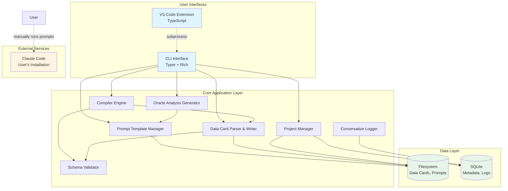

# Components

基于架构模式、技术栈和数据模型，MAestro 系统由以下逻辑组件组成（主要针对 CROS 阶段）。

## Component 1: Prompt Template Manager

**Responsibility:** 管理版本化的 prompt 模板（Microscope, Compiler, Oracle），支持加载、版本选择、参数注入和兼容性检查。

**Key Interfaces:**
- `load_template(template_type: str, version: str) -> PromptTemplate`
- `list_templates(template_type: str = None) -> List[PromptTemplate]`
- `validate_compatibility(template_id: str, model_version: str) -> bool`
- `inject_parameters(template: PromptTemplate, params: Dict) -> str`

**Dependencies:** Filesystem, SQLite (CROS), PyYAML

**Technology Stack:** Python 3.9+, Pydantic, Jinja2 (optional)

## Component 2: Data Card Parser & Writer

**Responsibility:** 解析 markdown 数据卡片文件为结构化 DataCard 对象，并将对象序列化回 markdown。

**Key Interfaces:**
- `parse_data_card(file_path: Path) -> DataCard`
- `write_data_card(data_card: DataCard, file_path: Path) -> None`
- `extract_data_points(markdown_table: str) -> List[DataPoint]`
- `parse_source_label(label_str: str) -> SourceLabel`

**Dependencies:** Filesystem, PyYAML, python-markdown, Pydantic

**Technology Stack:** Python 3.9+, python-markdown + 表格扩展

## Component 3: Schema Validator

**Responsibility:** 验证数据卡片、编译数据集和其他数据结构符合定义的 schema。

**Key Interfaces:**
- `validate_data_card(data_card: DataCard) -> ValidationResult`
- `validate_compiled_dataset(dataset_path: Path) -> ValidationResult`
- `check_required_fields(data_card: DataCard, criteria: Dict) -> List[str]`

**Dependencies:** Pydantic, pandas, Data Card Parser

**Technology Stack:** Python 3.9+ with type hints, Pydantic v2.6+

## Component 4: Compiler Engine

**Responsibility:** 聚合多个数据卡片为统一的 CSV/TSV 数据集，处理异构数据结构，生成数据质量摘要。

**Key Interfaces:**
- `compile_dataset(data_cards: List[Path], output_path: Path) -> CompiledDataset`
- `infer_schema(data_cards: List[DataCard]) -> Dict`
- `generate_quality_summary(dataset: CompiledDataset) -> Dict`

**Dependencies:** Data Card Parser, pandas, Schema Validator

**Technology Stack:** Python 3.9+, pandas 2.2+, numpy

## Component 5: Oracle Analysis Generator

**Responsibility:** 将自然语言研究问题转换为可执行的 R 或 Python 统计分析代码。

**Key Interfaces:**
- `generate_analysis_code(question: str, dataset_path: Path, language: str) -> Analysis`
- `interpret_results(code: str, output: str) -> str`
- `suggest_sensitivity_analyses(dataset: CompiledDataset) -> List[str]`

**Dependencies:** Prompt Template Manager, Compiled Dataset

**Technology Stack:** Python 3.9+, ast module (Python code validation)

## Component 6: Project Manager

**Responsibility:** 管理 Meta-analysis 项目的配置、元数据和状态跟踪。

**Key Interfaces:**
- `create_project(name: str, research_question: str, config: Dict) -> Project`
- `load_project(project_path: Path) -> Project`
- `update_project_status(project_id: str, status: str) -> None`
- `list_data_cards(project_id: str) -> List[Path]`

**Dependencies:** SQLite (CROS), Filesystem, PyYAML

**Technology Stack:** Python 3.9+, SQLite3, pathlib

## Component 7: Conversation Logger (CROS Only)

**Responsibility:** 记录用户与 Claude Code 的对话历史，支持成本追踪和审计。

**Key Interfaces:**
- `log_conversation(project_id: str, user_msg: str, metadata: Dict) -> None`
- `get_conversation_history(project_id: str, limit: int) -> List[ConversationLog]`
- `calculate_project_cost(project_id: str) -> float`

**Dependencies:** SQLite

**Technology Stack:** Python 3.9+, SQLite3, JSON

## Component 8: CLI Interface (Python CLI)

**Responsibility:** 提供命令行界面，暴露 MAestro 核心功能为 CLI 命令。

**Key Interfaces:**
- `maestro init <project_name>`
- `maestro microscope <paper.pdf>`
- `maestro compile [--output compiled.csv]`
- `maestro oracle "<question>"`
- `maestro validate [--fix]`

**Dependencies:** 所有上述核心组件, Typer, Rich

**Technology Stack:** Python 3.9+, Typer 0.12+, Rich 13.7+

## Component 9: VS Code Extension (TypeScript)

**Responsibility:** 提供图形化对话界面，集成到 VS Code 编辑器。

**Key Interfaces:**
- Webview Panel: 对话式 UI
- Editor Integration: 数据卡片语法高亮
- Command Palette: VS Code 命令

**Dependencies:** VS Code Extension API, Python CLI (subprocess)

**Technology Stack:** TypeScript 5.4+, VS Code Extension API 1.88+, esbuild

## Component Diagram

---
