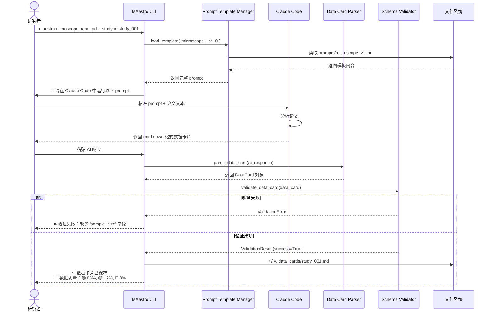
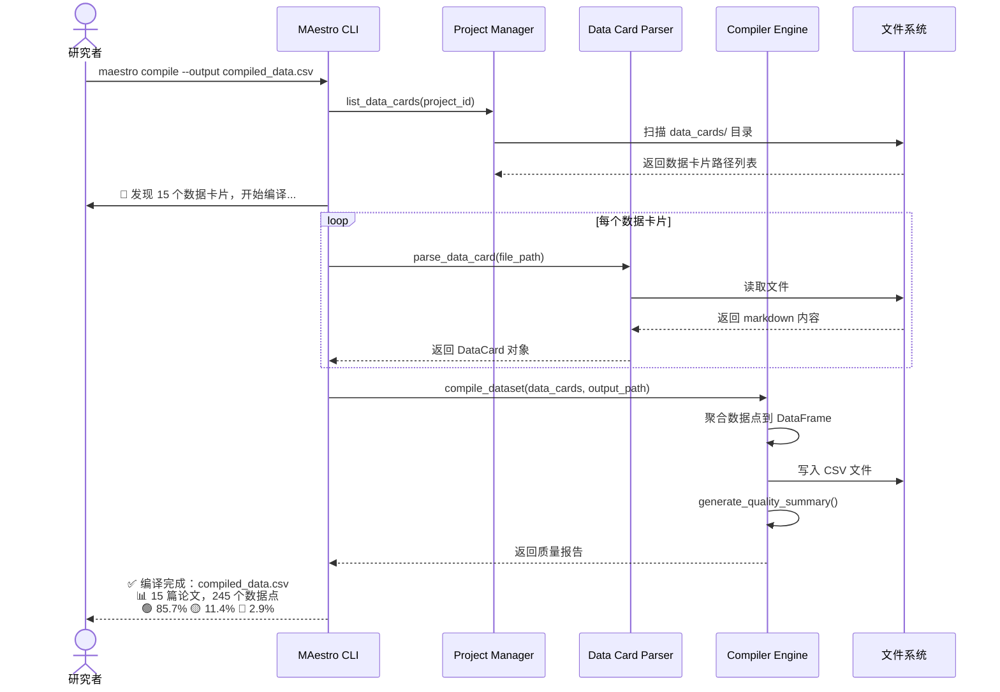
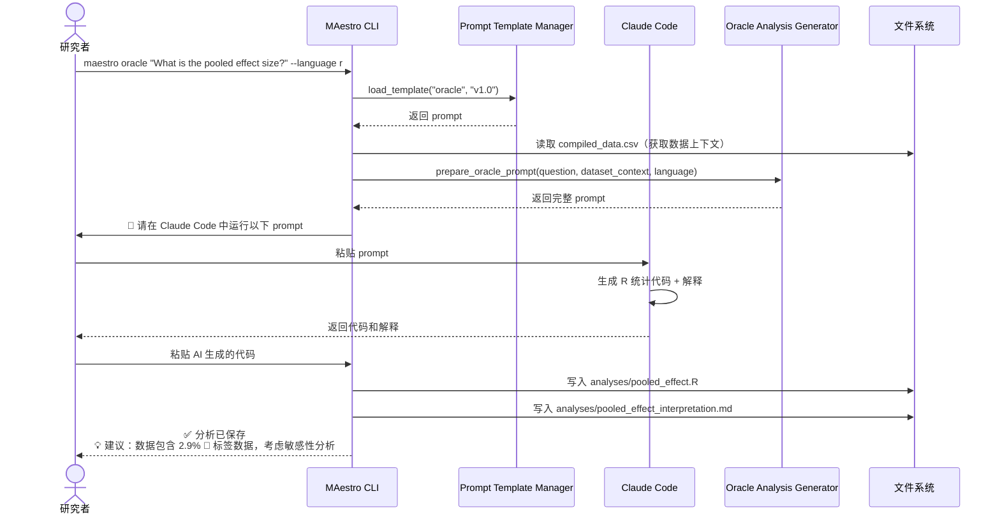
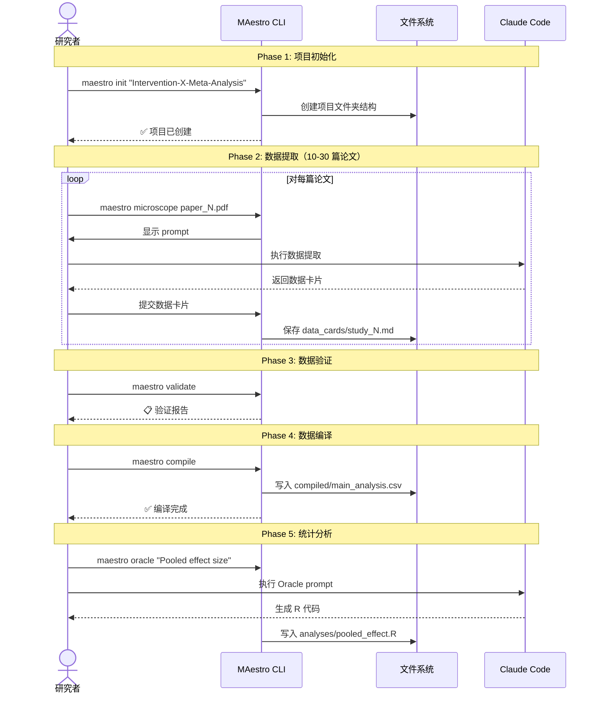

# Core Workflows

以下序列图展示 MAestro 的关键系统工作流。

## Workflow 1: Microscope - 单篇论文数据提取 (CROS 阶段)

## Workflow 2: Compiler - 数据集编译

## Workflow 3: Oracle - 统计分析生成

## Workflow 4: 端到端 Meta-analysis 流程

---
