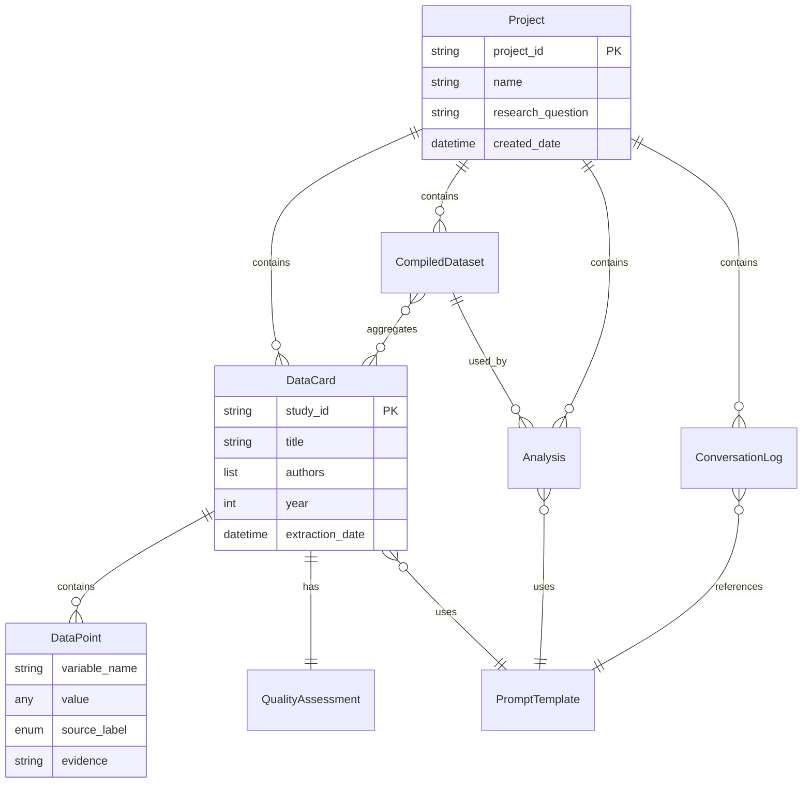

# Data Models

MAestro 的核心数据模型基于 **Data Card Microservice Architecture**，每个研究论文的数据以独立 markdown 文件形式存储。

## Model 1: DataCard (数据卡片)

**Purpose:** 表示单篇研究论文的完整数据提取结果，包括元数据、质量评估和提取的数据点。

**Key Attributes:**
- `study_id`: String - 唯一标识符
- `title`: String - 论文标题
- `authors`: List[String] - 作者列表
- `year`: Integer - 发表年份
- `doi`: String (optional) - 数字对象标识符
- `extraction_date`: DateTime - 数据提取日期
- `extractor`: String - 提取者姓名或ID
- `microscope_version`: String - 使用的 Microscope prompt 版本
- `claude_model`: String - 使用的 Claude 模型版本
- `screening_decision`: Enum["include", "exclude"] - 筛选决定
- `quality_scores`: Dict[String, Any] - 质量评估分数
- `extracted_data`: List[DataPoint] - 提取的数据点列表

**Relationships:**
- 属于一个 Project（通过文件系统路径关联）
- 包含多个 DataPoint（嵌套结构）
- 引用一个 PromptTemplate（Microscope版本）

## Model 2: DataPoint (数据点)

**Purpose:** 表示从论文中提取的单个数据字段，带有三色标签系统。

**Key Attributes:**
- `variable_name`: String - 变量名称
- `value`: Any - 提取的值
- `source_label`: Enum["🟢", "🟡", "🔴"] - 三色来源标签
- `evidence`: String - 证据说明（页码、章节、计算过程）

## Model 3: Project (Meta-analysis 项目)

**Purpose:** 表示一个完整的 Meta-analysis 项目，包含多个数据卡片和项目配置。

**Key Attributes:**
- `project_id`: String - 项目唯一标识符
- `name`: String - 项目名称
- `research_question`: String - 研究问题
- `created_date`: DateTime - 创建日期
- `data_cards_path`: Path - 数据卡片存储路径
- `extraction_criteria`: Dict[String, Any] - 数据提取标准
- `quality_checklist_module`: String - 使用的质量检查表模块

**Relationships:**
- 包含多个 DataCard（一对多）
- 包含多个 CompiledDataset（一对多）
- 包含多个 Analysis（一对多）

## Model 4: CompiledDataset (编译数据集)

**Purpose:** 表示从多个数据卡片聚合而成的统一数据集。

**Key Attributes:**
- `dataset_id`: String - 数据集唯一标识符
- `name`: String - 数据集名称
- `created_date`: DateTime - 创建日期
- `compiler_version`: String - 使用的 Compiler prompt 版本
- `source_data_cards`: List[String] - 源数据卡片路径列表
- `data_quality_summary`: Dict[String, Float] - 数据质量汇总

## Model 5: PromptTemplate (Prompt 模板)

**Purpose:** 表示版本化的 prompt 模板，支持 RAAA 可重现性要求。

**Key Attributes:**
- `template_id`: String - 模板唯一标识符
- `name`: String - 模板名称
- `version`: String - 版本号（SemVer格式）
- `type`: Enum["microscope", "compiler", "oracle"] - 模板类型
- `compatible_models`: List[String] - 兼容的 Claude 模型列表
- `template_content`: String - Prompt 内容

## Model 6: Analysis (统计分析)

**Purpose:** 表示 Oracle 生成的统计分析，包括代码和结果解释。

**Key Attributes:**
- `analysis_id`: String - 分析唯一标识符
- `name`: String - 分析名称
- `research_question`: String - 研究问题（自然语言）
- `oracle_version`: String - 使用的 Oracle prompt 版本
- `language`: Enum["r", "python"] - 代码语言
- `code`: String - 生成的分析代码
- `interpretation`: String - AI 生成的结果解释

## Model 7: ConversationLog (对话日志) - CROS 阶段

**Purpose:** 记录用户与 Claude Code 的交互历史，支持成本追踪功能。

**Key Attributes:**
- `log_id`: String - 日志唯一标识符
- `project_id`: String - 关联项目ID
- `timestamp`: DateTime - 对话时间
- `prompt_template_id`: String - 使用的模板ID
- `tokens_used`: Integer - 使用的 token 数量
- `model_version`: String - 使用的模型版本
- `cost_estimate`: Float - 估计成本（美元）

## Model 8: QualityAssessment (质量评估)

**Purpose:** 表示对单篇研究的质量评估结果。

**Key Attributes:**
- `assessment_id`: String - 评估唯一标识符
- `data_card_id`: String - 关联的数据卡片ID
- `checklist_module`: String - 使用的检查表
- `scores`: Dict[String, Any] - 评估分数
- `overall_quality`: Enum["high", "medium", "low"] - 总体质量评级

## Data Model Relationships

---
