# High Level Architecture

## Technical Summary

MAestro employs a **dual-phase evolutionary architecture** that transitions from pure prompt-based workflows (MVP) to a local-first desktop application (CROS). The MVP phase consists of version-controlled markdown prompt templates executed directly through Claude Code with zero application infrastructure. The CROS phase introduces a **local monolithic application** comprising a Python CLI (distributed via PyPI) and a VS Code Extension (distributed via VS Code Marketplace), both interacting with the Anthropic Claude API for AI-powered Meta-analysis workflows. All user data remains local (filesystem + SQLite), implementing **data card microservice architecture** where individual markdown files serve as atomic data units. This architecture achieves the PRD's 50% time reduction goal through conversation-driven automation while maintaining academic rigor via the three-color source labeling transparency system (🟢🟡🔴).

## High Level Overview

**1. Architectural Style:**

**MVP Phase:** **Template-Driven Stateless Workflow**
- No application server, no persistent state beyond filesystem
- Users manually execute prompt templates via Claude Code CLI/Desktop
- Pure markdown I/O with Git as version control system

**CROS Phase:** **Local Monolithic Desktop Application**
- Python CLI: Command-line orchestrator for batch operations and automation
- VS Code Extension: Conversational UI with rich text editing and visualization
- SQLite: Local metadata store (project configs, conversation history, logs, metrics)
- Filesystem: Primary data store (markdown data cards, CSV compilations, analysis outputs)

**Why Monolithic over Microservices:**
- Local-first mandate eliminates network latency concerns
- Simpler deployment (single PyPI package, single VSIX extension)
- Easier debugging with unified codebase
- Academic researcher users prefer "install and run" simplicity
- Scale target (10-100 papers) doesn't justify distributed complexity

**2. Repository Structure:**

**Monorepo** containing:
- **prompts/**: Microscope, Compiler, Oracle templates (MVP deliverables)
- **modules/**: Discipline-specific quality assessment frameworks
- **templates/**: Data card format, RAAA appendix scaffolding
- **docs/**: Quick Start, Best Practices, methodology documentation
- **tools/cli/**: Python CLI application (CROS Phase 1)
- **tools/vscode-extension/**: TypeScript VS Code extension (CROS Phase 2)
- **tests/**: Validation datasets, benchmark papers, automated tests
- **examples/**: Sample Meta-analysis projects

**3. Service Architecture:**

**MVP: No Services Architecture**
```
User (Terminal) → Claude Code CLI → Claude API → Markdown File Output
                     ↓
                  Filesystem (Git Repo)
```

**CROS: Local Application Architecture**
```
User Interface Layer:
  - Python CLI (Click/Typer) → Terminal I/O
  - VS Code Extension (TypeScript) → Webview UI + Editor Integration

Application Layer:
  - CROS Core (Python): Workflow orchestration, prompt management, validation
  - Claude Code Integration: AI model calls managed by Claude Code

Data Layer:
  - SQLite: Project metadata, conversation logs, user preferences
  - Filesystem: Data cards (.md), compilations (.csv), analyses (.R/.py)
```

**4. Primary User Flow (CROS Phase):**

**Microscope Workflow:** User initiates → CROS generates prompt → User runs in Claude Code → CROS validates & saves data card

**Compiler Workflow:** User requests compilation → CROS aggregates data cards → Generates CSV with quality report

**Oracle Workflow:** User asks statistical question → CROS generates prompt → Claude generates code → User executes in R/Python

**5. Key Architectural Decisions & Rationale:**

| Decision | Rationale |
|----------|-----------|
| **Local-first (no cloud backend)** | Academic data privacy requirements; avoids PHI/PII concerns; works offline |
| **Filesystem as primary data store** | Git-compatible; human-readable; supports manual editing/validation |
| **SQLite for metadata only** | Lightweight, zero-config; filesystem remains source of truth |
| **Markdown data cards** | Version-controllable, readable without tools, compatible with academic publishing |
| **Dual distribution (PyPI + VS Code)** | Serves CLI power users AND GUI-preferring researchers |
| **Python 3.9+ for CLI** | Research community familiarity; rich ecosystem; type hints for maintainability |
| **TypeScript for Extension** | Required by VS Code API; type safety for complex UI |
| **Monorepo structure** | Simplifies coordination; shared examples/tests; atomic versioning |

## High Level Project Diagram

```mermaid
graph TB
    subgraph "User Environment (Local Machine)"
        User[👤 Researcher]
        Terminal[Terminal/Claude Code CLI]
        VSCode[VS Code + MAestro Extension]

        subgraph "MAestro CROS Application"
            CLI[Python CLI<br/>Click/Typer]
            Extension[VS Code Extension<br/>TypeScript]
            Core[CROS Core<br/>Workflow Orchestration]
            Prompts[Prompt Templates<br/>Microscope/Compiler/Oracle]
            Validator[Schema Validator<br/>Data Quality Checker]
        end

        subgraph "Local Data Storage"
            FS[Filesystem<br/>Data Cards, CSV, Code]
            DB[(SQLite<br/>Metadata, Logs, Config)]
            Git[Git Repository<br/>Version Control]
        end

        User -->|CLI commands| Terminal
        User -->|Conversational UI| VSCode
        Terminal --> CLI
        VSCode --> Extension
        CLI --> Core
        Extension --> Core
        Core --> Prompts
        Core --> Validator
        Core -->|Read/Write| FS
        Core -->|Query/Insert| DB
        FS -.->|Tracks changes| Git

    end

    subgraph "External Services"
        Claude[Claude Code<br/>AI Model Calls]
    end

    Core -.->|User manually runs prompts| Claude
    Claude -.->|Responses| User

    style User fill:#e1f5ff
    style Claude fill:#fff4e1
    style FS fill:#e8f5e9
    style DB fill:#e8f5e9
    style Core fill:#f3e5f5
```



## Architectural and Design Patterns

### Pattern 1: Template-Driven Workflow Orchestration
**Description:** Prompts are first-class architectural components stored as versioned templates with metadata (compatible models, creation date, version). CROS loads templates dynamically, injects user context, and tracks which template version was used for reproducibility.

**Rationale:** Enables RAAA (Reproducible AI-Assisted Analysis) requirement; allows prompt evolution without code changes; supports academic transparency standards.

### Pattern 2: Data Card Microservice Architecture
**Description:** Each research paper's extracted data lives in an independent markdown file with YAML frontmatter (metadata) and markdown tables (data). Files are atomic units that can be created, validated, versioned, and compiled independently.

**Rationale:** Aligns with Git workflows; enables parallel extraction by teams; supports manual correction/validation; failed extractions don't corrupt project state.

### Pattern 3: Three-Color Source Labeling System
**Description:** Every extracted data point tagged with 🟢 (direct quote + evidence), 🟡 (computed inference + calculation shown), or 🔴 (uncertain/missing + explanation). Labels propagate through Compiler to final dataset.

**Rationale:** Core differentiator for academic credibility; enables data quality-aware statistical analysis; supports PRD requirement for 90%+ uncertain data flagging.

### Pattern 4: Local-First with Cloud Augmentation
**Description:** All user data (papers, data cards, analyses) stored locally. Only prompts + paper text sent to Claude API via Claude Code. No MAestro-managed API keys.

**Rationale:** Meets academic data privacy standards; works offline (except extraction step); avoids vendor lock-in; reduces API costs.

### Pattern 5: Dual Interface Pattern (CLI + Extension)
**Description:** Python CLI provides scriptable automation for power users. VS Code Extension provides conversational UI for interactive workflows. Both share CROS Core via different entry points.

**Rationale:** Serves diverse user base; VS Code extension leverages existing researcher tooling; allows phased development.

### Pattern 6: Stateless Validation with Schema-Driven Contracts
**Description:** Data card format defined by JSON schema. Compiler and Oracle validate inputs against schema before processing. Validation errors surface immediately with actionable messages.

**Rationale:** Prevents garbage-in-garbage-out; enables early failure; supports PRD's "90%+ agreement with expert extraction" goal.

### Pattern 7: Conversation Memory with SQLite
**Description:** CROS maintains lightweight conversation history in SQLite (user queries, AI responses, context windows used). Enables "resume workflow" and "refine previous extraction" features.

**Rationale:** Bridges MVP (stateless) to CROS vision (stateful sessions); reduces token costs; improves UX.

---
